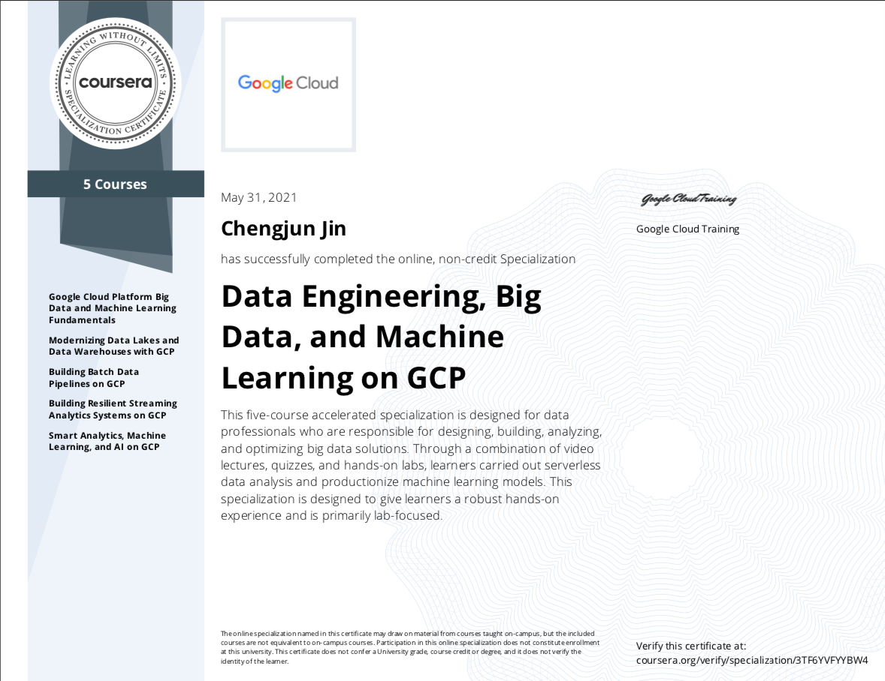

# Data Engineering, Big Data, and Machine Learning on GCP Specialization

Data Engineering on Google Cloud Platform. Launch your career in Data Engineering. Deliver business value with big data and machine learning.

Five courses are included:**
* Course 1: Google Cloud Platform Big Data and Machine Learning Fundamentals
* Course 2: Modernizing Data Lakes and Data Warehouses with GCP
* Course 3: Building Batch Data Pipelines on GCP
* Course 4: Building Resilient Streaming Analytics Systems on GCP
* Course 5: Smart Analytics, Machine Learning, and AI on GCP

**Verified certificate:** [Check the online version
here](https://www.coursera.org/account/accomplishments/specialization/certificate/3TF6YVFYYBW4)

-------------------------------------------

## About Course 1: Google Cloud Platform Big Data and Machine Learning Fundamentals

This course introduces participants to the big data capabilities of Google
Cloud. Through a combination of presentations, demos, and hands-on labs,
participants get an overview of Google Cloud and a detailed view of the data
processing and machine learning capabilities. This course showcases the ease,
flexibility, and power of big data solutions on Google Cloud.

--------------------------------------------------

## About* Course 2: Modernizing Data Lakes and Data Warehouses with GCP

The two key components of any data pipeline are data lakes and warehouses. This
course highlights use-cases for each type of storage and dives into the
available data lake and warehouse solutions on Google Cloud Platform in
technical detail. Also, this course describes the role of a data engineer, the
benefits of a successful data pipeline to business operations, and examines why
data engineering should be done in a cloud environment. Learners will get
hands-on experience with data lakes and warehouses on Google Cloud Platform
using QwikLabs.

--------------------------------------------------

## About* Course 3: Building Batch Data Pipelines on GCP

Data pipelines typically fall under one of the Extra-Load,
Extract-Load-Transform or Extract-Transform-Load paradigms. This course
describes which paradigm should be used and when for batch data. Furthermore,
this course covers several technologies on Google Cloud Platform for data
transformation including BigQuery, executing Spark on Cloud Dataproc, pipeline
graphs in Cloud Data Fusion and serverless data processing with Cloud Dataflow.
Learners will get hands-on experience building data pipeline components on
Google Cloud Platform using Qwiklabs.

--------------------------------------------------

## About* Course 4: Building Resilient Streaming Analytics Systems on GCP

Processing streaming data is becoming increasingly popular as streaming enables
businesses to get real-time metrics on business operations. This course covers
how to build streaming data pipelines on Google Cloud Platform. Cloud Pub/Sub
is described for handling incoming streaming data. The course also covers how
to apply aggregations and transformations to streaming data using Cloud
Dataflow, and how to store processed records to BigQuery or Cloud Bigtable for
analysis. Learners will get hands-on experience building streaming data
pipeline components on Google Cloud Platform using QwikLabs.

--------------------------------------------------

## About* Course 5: Smart Analytics, Machine Learning, and AI on GCP

Incorporating machine learning into data pipelines increases the ability of
businesses to extract insights from their data. This course covers several ways
machine learning can be included in data pipelines on Google Cloud Platform
depending on the level of customization required. For little to no
customization, this course covers AutoML. For more tailored machine learning
capabilities, this course introduces AI Platform Notebooks and BigQuery Machine
Learning. Also, this course covers how to productionalize machine learning
solutions using Kubeflow. Learners will get hands-on experience building
machine learning models on Google Cloud Platform using QwikLabs.

